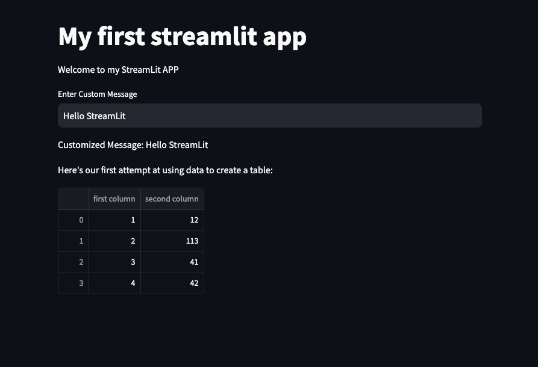

# Streamlit Tutorial
Upon making a more comprehensive application for many of the side projects created on the daily, there is always the problem of showcasing the work that is being done in a simple yet interactive way.
Github can be a great place to some code, but there is no so-called `pizzazz` to the end outcome, with just a readme that can be a little underwhelming.

Thus, to try out a more robust way to showcase the project I do, while still keeping it to the minimum to deploy, I wanted to try out `streamlit`.


## 🔥 What is Streamlit?
Streamlit is an open-source Python framework that simplifies the creation of interactive web applications for data science and machine learning projects. It allows developers to quickly build and deploy custom web apps by writing simple Python scripts without needing extensive front-end development skills. Streamlit supports real-time updates and provides intuitive, easy-to-use APIs for visualizing data and adding interactive widgets. You can learn more about Streamlit on their [homepage](https://streamlit.io).


## 🚀 Building your first Streamlit application
Creating a streamlit application can be simple as couple lines of code.

### Prerequisites

Before we get started, make sure that you have StreamLit installed in your local device. You can simply use a `pip` command:

``` sh
pip install streamlit
```

Now, streamlit should be configured and ready to go.

### Creating a simple StreamLit App

Let's start by initializing the Streamlit application that displays a customizable display and a simple `pandas` display.

``` python
import streamlit as st
st.title("StreamLit APP")
st.write("Welcome to the streamlit app!!")
```

One important detail about Streamlit is the `st.write()` function. As noted on the official documentation as well, it is a **Magical** function that can be used to write anything from text to tables. And this is where the beauty of this application comes.
As you will down below, the `write` function can take mostly any of the visualization aspects that is generally seen in the python language, from pandas to matplotlib visualization easily deployable in a couple of seconds. We can see here that we had written a simple welcoming message that can be then seen on the web.

Now let us implement a bit more stuff such as a `DataFrame` from pandas library:

``` python
st.write(pd.DataFrame({
    'first column': [1, 2, 3, 4],
    'second column': [10, 20, 30, 40]
}))
```

And also a Customized Input section:

``` python
user_input = st.text_input('Enter Custom Message', 'Hello StreamLit')
st.write('Customized Message:', user_input)
```

### Running the StreamLit App
Now that we have ourselves a simple streamlit application at our hands, let us now run it on our local browser. Open the terminal or command prompt and navigate to the directory where you have just written your script.
Then, execute the following command:

``` sh
streamlit run main.py
```

Great! Now the application should be running on your browser.


The great thing about streamlit is the ability to be able to create interactive components without the need to use `css` and `js` which can be time consuming when creating a simple UI for smaller projects. 

## ✅ Building a more comprehensive application

Now, we are going to do something a bit more complex. To demostrate a fully functional application webpage, we are going to take some inspiration from the [Prudhvi's Black Sholes Pricing Model](https://github.com/prudhvi-reddy-m/BlackScholes). This is a application made with streamlit and what got me into creating fully interactive application in streamlit in the first place. So please check out his other works as well!!

### Black Sholes Algorithm
A quick tangent for the **BlackSholes Algorithm**:

The Black-Scholes model is a mathematical framework used to price European options, relying on the Black-Scholes equation:

$$
\frac{\partial V}{\partial t} + \frac{1}{2} \sigma^2 S^2 \frac{\partial^2 V}{\partial S^2} + r S \frac{\partial V}{\partial S} - rV = 0
$$
The solution provides closed-form pricing formulas for call and put options, such as for a call option:

$$
C = S_0 N(d_1) - X e^{-rT} N(d_2)
$$

where $ d_1 $ and $ d_2$ are functions of the underlying asset price, strike price, time to maturity, interest rate, and volatility. Despite its usefulness, the model assumes constant volatility and interest rates, which may not hold in real markets.

Now let us create a code implementation of the Black Sholes algorithm by creating a python class:
```python
import numpy as np
from scipy.stats import norm

class BlackSholes:

    def __init__(self,
                 time_to_maturity: float,
                 strike: float,
                 current_price: float,
                 volatility: float, 
                 interest_rate: float,
                 ):
        self.time_to_maturity = time_to_maturity
        self.strike = strike
        self.current_price = current_price
        self.volatilty = volatility
        self.interest_rate = interest_rate


    def run(self):

        time_to_maturity = self.time_to_maturity
        strike = self.strike
        current_price = self.current_price
        volatility = self.volatilty
        interest_rate = self.interest_rate

        d1 = (
            (np.log(current_price / strike) + (interest_rate + 0.5 * (volatility ** 2)) * time_to_maturity) / (volatility * np.sqrt(time_to_maturity))
        )

        d2 = d1 - (volatility * np.sqrt(time_to_maturity))

        call_price = current_price * norm.cdf(d1) - (strike * np.exp(-(interest_rate * time_to_maturity)) * norm.cdf(d2)) 
        put_price = (strike * np.exp(-(interest_rate * time_to_maturity)) * norm.cdf(-d2)) - current_price * norm.cdf(-d1)

        self.call_price = call_price
        self.put_price = put_price

        # Delta
        self.call_delta = norm.cdf(d1)
        self.put_delta = 1 - norm.cdf(d2)

        # Gamma
        self.call_gamma = norm.pdf(d1) / (strike * volatility * np.sqrt(time_to_maturity))
        self.put_gamma = self.call_gamma
```

As you can see, the main component of the algorithm calculations are done here to calculate `d1` and `d2`, which are crucial to the algorithm.
While d1 and d2 do not directly indicate whether the underlying asset price will increase or decrease. Instead, they help to determine the probability of the option being profitable (in the money) at expiration, given the current conditions:​
  - d1 is more closely related to the option's delta and can give insight into how much the option's price will change with small movements in the underlying asset's price. 
  - d2 is used to calculate the risk-neutral probability that the option will expire in the money.

### Implementing HTML and CSS components
Now that the meat of the application is finished, we can now focus on how to make it look great and interactive on the web. For this we do need some simple html and css basics to aid our implementation. The goal here is to allow users of the site to tune the parameters, and outputting the values as a heatmap. As prudvi did, we can use a `sidebar` for the parameter tuning and a main display to showcase all of the important statistics. 

Let us now see how the sidebar can be implemented:
```python
with st.sidebar:
    st.title("Title Here")

    current_price = st.number_input("Current Asset Price", value=100.0)
    strike = st.number_input("Strike Price", value=100.0)
    time_to_maturity = st.number_input("Time to Maturity (Years)", value=1.0)
    volatility = st.number_input("Volatility (σ)", value=0.2)
    interest_rate = st.number_input("Risk-Free Interest Rate", value=0.05)

    st.markdown("---")
    calculate_btn = st.button('Heatmap Parameters')
    spot_min = st.number_input('Min Spot Price', min_value=0.01, value=current_price*0.8, step=0.01)
    spot_max = st.number_input('Max Spot Price', min_value=0.01, value=current_price*1.2, step=0.01)
    vol_min = st.slider('Min Volatility for Heatmap', min_value=0.01, max_value=1.0, value=volatility*0.5, step=0.01)
    vol_max = st.slider('Max Volatility for Heatmap', min_value=0.01, max_value=1.0, value=volatility*1.5, step=0.01)
    
    spot_range = np.linspace(spot_min, spot_max, 10)
    vol_range = np.linspace(vol_min, vol_max, 10)
```

Here you can see some of the components that streamlit provides, such as:

#### `number_input`

The `number_input` widget allows users to input numeric values through a simple input field interface. It can be configured for integers or floating-point numbers.

```python
import streamlit as st

# For integer inputs
number = st.number_input('Insert a number', min_value=0, max_value=100, value=25, step=1)

# For floating-point inputs
number = st.number_input('Insert a number', min_value=0.0, max_value=100.0, value=25.5, step=0.5)
```
**Parameters**

- **label** (str): The label displayed to the user.
- **min_value** (int or float): The minimum value the user can select.
- **max_value** (int or float): The maximum value the user can select.
- **value** (int or float): The initial value of the input field.
- **step** (int or float): The step size between values.

#### `slider`

The `slider` widget allows users to select a numeric value within a specified range by dragging a handle along a bar.

```python
import streamlit as st

# Slider for integers
value = st.slider('Select a value:', min_value=0, max_value=100, value=50, step=1)

# Slider for floating-point numbers
value = st.slider('Select a value:', min_value=0.0, max_value=100.0, value=50.0, step=0.5)
```
**Parameters**

- **label** (str): The label displayed to the user.
- **min_value** (int or float): The minimum value of the slider.
- **max_value** (int or float): The maximum value of the slider.
- **value** (int or float): The initial value or the default position of the slider handle.
- **step** (int or float): The incremental step between values as the user moves the slider.
